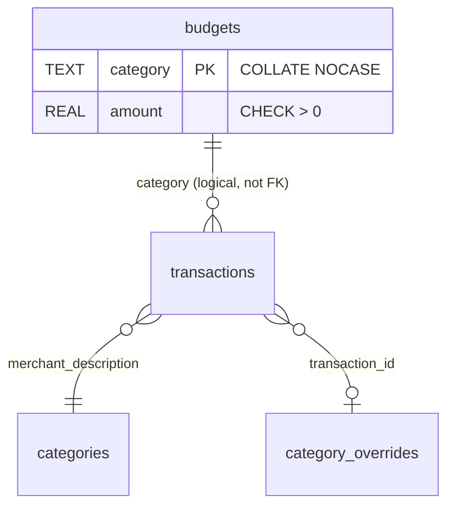

# feat: Add Per-Category Budget Tracking

## Enhancement Summary

**Deepened on:** 2026-03-24
**Research agents used:** Architecture Strategist, Data Integrity Guardian, Performance Oracle, Security Sentinel, Pattern Recognition Specialist, Code Simplicity Reviewer, TypeScript Reviewer, Best Practices Researcher, Framework Docs Researcher

### Key Improvements from Research

1. **API design corrected** — changed from PUT/DELETE-with-body to POST/DELETE-with-path-param, matching codebase conventions (no PUT or DELETE endpoints exist in codebase)
2. **Schema hardened** — added `COLLATE NOCASE` for case-insensitive category matching and `CHECK(length(trim(category)) > 0)` to prevent empty names
3. **Phased delivery** — history tab and LLM integration deferred to v2 to reduce scope by ~35% and ship core value faster
4. **Security gaps addressed** — request body size limits, periods parameter clamping, input length validation
5. **Performance optimization** — single-query CASE bucketing for history (when built), React Query staleTime configuration
6. **Accessibility requirements** — ARIA attributes on progress bars, color-independent status indicators
7. **Simplified response shape** — split budgeted/unbudgeted categories instead of nullable fields

### Scope Reduction (YAGNI)

The simplicity review identified that the original plan bundled three iterations of work. The revised plan ships the **minimal viable budget feature** first:

| Component | Status | Rationale |
|-----------|--------|-----------|
| Budget CRUD + status page | **v1 (this plan)** | Core user story |
| History tab + endpoint | **Deferred to v2** | Analytics page already shows category trends; history retroactively applies current budgets which is misleading |
| LLM integration | **Deferred to v2** | Speculative value; visual indicators on budget page are more reliable |
| `GetByCategory` store method | **Removed** | No caller exists |
| Excluded-category backend validation | **Removed** | Frontend-only concern; harmless if bypassed |
| `GET /api/budgets` (raw list) | **Removed** | Status endpoint subsumes it |

---

## Overview

Add a per-category budget system that lets users set spending limits for each transaction category and track progress against those limits within billing cycles. Includes a dedicated `/budgets` page with progress visualization for the current billing period.

## Problem Statement / Motivation

The finance tracker shows what users spent but not whether spending is on track. There is no way to set spending targets or see progress against personal goals. Users must mentally compare numbers across pages to judge whether they're overspending in a category. (see brainstorm: `docs/brainstorms/2026-03-24-budgets-brainstorm.md`)

## Proposed Solution

A new `budgets` database table (migration 003) storing per-category spending limits. A dedicated `/budgets` page shows all categories with progress bars for the current billing period.

### Key Decisions (from brainstorm)

1. **New `budgets` table** — category name as primary key, amount column
2. **Billing cycle alignment** — budgets reset on billing day (15th), reusing `billing/periods.go`
3. **Per-category only** — no overall cap, no sub-categories
4. **Dedicated `/budgets` page** — progress bars, edit controls
5. **Web UI management only** — no config files
6. **No budget for "Uncategorized"** — encourages proper categorization
7. ~~**Multi-period history** — show 3-6 past billing periods~~ → deferred to v2
8. ~~**LLM integration** — budget limits included in analysis prompt~~ → deferred to v2

## Technical Approach

### Database Schema

New migration `internal/database/migrations/003_budgets.sql`:

```sql
-- +goose Up
CREATE TABLE budgets (
    category TEXT NOT NULL PRIMARY KEY COLLATE NOCASE,
    amount REAL NOT NULL CHECK(amount > 0),
    CHECK(length(trim(category)) > 0)
);

-- +goose Down
DROP TABLE IF EXISTS budgets;
```

#### Research Insights

**Schema hardening (Data Integrity Guardian):**
- `COLLATE NOCASE` on the PK prevents case-sensitivity mismatches between budget keys and `CountByCategory` output. Without this, a budget for "Groceries" would not match spending categorized as "groceries".
- `CHECK(length(trim(category)) > 0)` prevents empty or whitespace-only category names that would never match spending data.
- Plain `CREATE TABLE` (not `IF NOT EXISTS`) because goose guarantees migration ordering — if 003 runs, 001 and 002 have already run.
- Timestamps (`created_at`/`updated_at`) removed — no feature in v1 uses them. Add via migration if audit history is needed later.

**REAL for monetary amounts is adequate** — matches existing `accounts.balance` and `transactions.amount` storage. Budget amounts are user-entered round numbers, so IEEE 754 precision is not a concern.

**TEXT PRIMARY KEY performance** — lookups are ~2x slower than INTEGER PK, but with <30 budget rows this is irrelevant. `WITHOUT ROWID` could optimize storage but no existing table uses it, so stay consistent.



### Store Layer

New file `internal/store/budgets.go`:

```go
type BudgetStore struct {
    read  *sql.DB
    write *sql.DB
}

func NewBudgetStore(read, write *sql.DB) *BudgetStore {
    return &BudgetStore{read: read, write: write}
}
```

**Budget model** in `internal/models/models.go` (cross-layer entity):
```go
type Budget struct {
    Category string  `json:"category"`
    Amount   float64 `json:"amount"`
}
```

**Store methods** (3 total — `GetByCategory` removed as it has no caller):
- `GetAll(ctx) ([]Budget, error)` — list all budgets
- `Upsert(ctx, category, amount) error` — `INSERT INTO budgets ... ON CONFLICT(category) DO UPDATE SET amount = excluded.amount`
- `Delete(ctx, category) error` — remove a budget

**Response types** in `internal/api/budgets.go` (handler-level, not shared):
```go
// Separate types for budgeted vs unbudgeted — no nullable fields
type BudgetedCategory struct {
    Category  string  `json:"category"`
    Amount    float64 `json:"amount"`
    Spent     float64 `json:"spent"`
    Remaining float64 `json:"remaining"`
    Percent   float64 `json:"percent"`
}

type UnbudgetedCategory struct {
    Category string  `json:"category"`
    Spent    float64 `json:"spent"`
}

type BudgetStatusResponse struct {
    Period     BillingPeriodInfo   `json:"period"`
    Budgeted   []BudgetedCategory  `json:"budgeted"`
    Unbudgeted []UnbudgetedCategory `json:"unbudgeted"`
}
```

#### Research Insights

**Pattern compliance (Pattern Recognition + Architecture Strategist):**
- Store struct with `read`/`write *sql.DB` pools matches all 6 existing stores exactly.
- `Budget` model goes in `internal/models/models.go` since it's a persisted entity crossing layer boundaries (like `DBTransaction`, `Analysis`).
- `BudgetedCategory`/`UnbudgetedCategory` stay in the handler file as response-specific types (like `CategoryTrendResponse` in `analytics.go`).
- No store references another store — cross-store queries are done by the handler.

**Simplification (Code Simplicity Reviewer):**
- Split response into `budgeted`/`unbudgeted` arrays instead of nullable `*float64` fields. The frontend renders these groups differently anyway, so the data shape matches the UI shape. Eliminates null checks in every frontend component.

### API Endpoints

New file `internal/api/budgets.go`:

| Method | Path | Description |
|--------|------|-------------|
| `POST` | `/api/budgets` | Upsert budget `{"category": "...", "amount": N}` |
| `DELETE` | `/api/budgets/{category}` | Delete budget for category |
| `GET` | `/api/budgets/status` | Budget status for current period: budgeted + unbudgeted categories |

**`GET /api/budgets/status` response shape:**
```json
{
  "data": {
    "period": {"label": "Mar 2026", "start": 1740787200, "end": 1743465600},
    "budgeted": [
      {"category": "Groceries", "amount": 500.00, "spent": 320.45, "remaining": 179.55, "percent": 64.09}
    ],
    "unbudgeted": [
      {"category": "Dining", "spent": 187.30}
    ]
  }
}
```

**Billing period behavior:** The status endpoint computes period boundaries directly using a new `billing.CurrentBillingPeriod(billingDay)` function rather than `CalculateDateRange`. This avoids the 5-day auto-rollback behavior. The response includes explicit period label and dates.

**Validation rules:**
- `amount` must be > 0 and <= 1,000,000 (reject zero, negative, NaN, Inf)
- `category` must be non-empty, max 100 characters, trimmed
- `category` must not be "Uncategorized"
- Add `http.MaxBytesReader(w, r.Body, 1<<20)` before JSON decode

#### Research Insights

**API design corrected (Pattern Recognition + Architecture Strategist):**
- Changed from `PUT` to `POST` — the codebase has zero `PUT` endpoints. `POST` is the established verb for create/upsert operations (see `POST /api/categories/exclude`, `POST /api/sync`).
- Changed from `DELETE` with JSON body to `DELETE /api/budgets/{category}` with path param — every resource identifier in the codebase is passed as a path parameter. DELETE-with-body is non-standard and many HTTP clients/proxies strip request bodies from DELETE. Use `r.PathValue("category")` with `url.PathUnescape()` for names with special characters.
- Removed standalone `GET /api/budgets` — the status endpoint returns all budget amounts alongside spending, making the raw list redundant.

**Security hardening (Security Sentinel):**
- `http.MaxBytesReader(w, r.Body, 1<<20)` prevents memory exhaustion from oversized request bodies. Apply to all endpoints that decode JSON.
- Category length cap (100 chars) prevents storage/rendering issues from extremely long strings.
- Amount upper bound (1,000,000) and `math.IsNaN`/`math.IsInf` checks prevent edge cases.
- Return generic error messages to clients, log details server-side: `log.Error().Err(err).Msg("..."); WriteError(w, 500, "INTERNAL", "An internal error occurred")`

**Existing validation patterns to follow:**
```go
// Parse body with size limit
r.Body = http.MaxBytesReader(w, r.Body, 1<<20)
var body struct {
    Category string  `json:"category"`
    Amount   float64 `json:"amount"`
}
if err := json.NewDecoder(r.Body).Decode(&body); err != nil {
    WriteError(w, http.StatusBadRequest, "BAD_REQUEST", "Invalid request body")
    return
}
body.Category = strings.TrimSpace(body.Category)
if body.Category == "" || len(body.Category) > 100 {
    WriteError(w, http.StatusBadRequest, "BAD_REQUEST", "Invalid category name")
    return
}
if body.Amount <= 0 || body.Amount > 1_000_000 || math.IsNaN(body.Amount) || math.IsInf(body.Amount, 0) {
    WriteError(w, http.StatusBadRequest, "BAD_REQUEST", "Amount must be between 0 and 1,000,000")
    return
}
if strings.EqualFold(body.Category, "Uncategorized") {
    WriteError(w, http.StatusBadRequest, "BAD_REQUEST", "Cannot set budget for Uncategorized")
    return
}
```

### Frontend

New page `web/src/pages/Budgets.tsx`:

**Layout:**
- Header: "Budgets" with period label (e.g., "Mar 15 - Apr 14, 2026")
- Single view (no tabs — history deferred to v2)

**Budget list:**
- Budgeted categories sorted by percent consumed (highest risk first)
- Each row: category name, progress bar (emerald < 75%, amber 75-90%, red 90%+), "$320 / $500" text, inline edit button
- Over-budget: red progress bar at 100%, changed track background (red-tinted), "Over by $X" in red text
- Unbudgeted categories shown below with muted styling and "Set Budget" button

**Budget editing:**
- Inline click-to-edit: click amount to enter edit mode, Enter to save, Escape to cancel, blur to save
- Uses `POST /api/budgets` with React Query mutation
- On success: invalidate `["budgets"]` (prefix match catches status)
- Skip optimistic updates — use simple invalidation (data accuracy > perceived speed for a finance app)

**Empty state:** Icon + "No budgets set yet" heading + "Set spending limits for your categories to track your budget." + "Set up budgets" button that shows all categories with inline amount inputs.

**New files:**
- `web/src/pages/Budgets.tsx` — page component
- `web/src/components/budget/BudgetProgressBar.tsx` — progress bar with ARIA
- `web/src/components/budget/InlineBudgetEditor.tsx` — click-to-edit amount
- Types added to `web/src/api/types.ts`
- Hooks added to `web/src/api/queries.ts`

**Modified files:**
- `web/src/components/layout/Sidebar.tsx` — add `{ to: "/budgets", label: "Budgets" }` to links array
- `web/src/App.tsx` — add `<Route path="budgets" element={<Budgets />} />`
- `web/src/api/queries.ts` — add `deleteApi` helper (or generalized `mutateApi`)

#### Research Insights

**Progress bar design (Best Practices Researcher):**
- Color thresholds: emerald (0-74%), amber (75-89%), red (90-99%), red with tinted track (100%+). The 75% threshold is industry consensus (Carbon Design System, PatternFly).
- Over-budget visual treatment: change track background from neutral to `bg-red-100`/`bg-red-950`, subtle pulse animation, "Over by $X" text below bar.
- Never rely on color alone — pair every color with text status and use `tabular-nums` for aligned number columns.

**Accessibility (TypeScript Reviewer + Best Practices):**
```tsx
<div
  role="progressbar"
  aria-valuenow={Math.round(percent)}
  aria-valuemin={0}
  aria-valuemax={100}
  aria-label={`${category} budget: ${Math.round(percent)}% used. ${statusText}`}
  className="h-2.5 w-full rounded-full overflow-hidden bg-muted"
>
  <div
    className={`h-full rounded-full transition-all duration-500 ease-out ${barColor}`}
    style={{ width: `${Math.min(percent, 100)}%` }}
  />
</div>
```
These ARIA attributes are non-negotiable — without them, screen readers see nothing.

**shadcn/ui has a Progress component** (`npx shadcn@latest add progress`) built on Radix that provides ARIA for free. Consider using it instead of a custom div, with color customization via `[&>div]:bg-emerald-500` Tailwind selectors.

**Inline editing UX (Best Practices):**
- Click to edit (not double-click) — matches spreadsheet conventions
- Select-all on focus so users can type replacement immediately
- Enter to save, Escape to cancel, blur to save (not cancel)
- Show the current value as a clickable button when not editing

**Frontend API helpers (TypeScript Reviewer + Pattern Recognition):**
- The codebase has `fetchApi` (GET) and `postApi` (POST) but no PUT/DELETE helpers. Add a generalized `mutateApi` or individual `deleteApi`:

```typescript
async function deleteApi(url: string): Promise<void> {
  const res = await fetch(url, { method: "DELETE" });
  if (!res.ok) {
    const err = await res.json().catch(() => ({ error: { message: res.statusText } }));
    throw new Error(err.error?.message || res.statusText);
  }
}
```

**TypeScript types (TypeScript Reviewer):**
```typescript
// Split response — no nullable fields
export interface BudgetedCategory {
  category: string;
  amount: number;
  spent: number;
  remaining: number;
  percent: number;
}

export interface UnbudgetedCategory {
  category: string;
  spent: number;
}

export interface BudgetStatusResponse {
  period: { label: string; start: number; end: number };
  budgeted: BudgetedCategory[];
  unbudgeted: UnbudgetedCategory[];
}
```

**React Query configuration:**
```typescript
export function useBudgetStatus() {
  return useQuery({
    queryKey: ["budgets", "status"],
    queryFn: () => fetchApi<BudgetStatusResponse>("/api/budgets/status"),
    staleTime: 5 * 60 * 1000, // 5 minutes — data only changes on new transactions or budget edits
  });
}
```

**Currency formatting (Best Practices):**
```typescript
const currencyFormatter = new Intl.NumberFormat("en-US", {
  style: "currency", currency: "USD",
  minimumFractionDigits: 0, maximumFractionDigits: 0,
});
export function formatCurrency(amount: number): string {
  return currencyFormatter.format(Math.abs(amount));
}
```
Show "Over by $X" as primary indicator (absolute dollar amount is more actionable), percentage as secondary context.

### Billing Period Helper

New function in `internal/billing/periods.go`:

```go
// CurrentBillingPeriod returns the raw current billing cycle boundaries
// without the 5-day auto-rollback heuristic used by CalculateDateRange.
func CurrentBillingPeriod(billingDay int) (start, end time.Time) {
    // ... compute current period start/end based on billingDay and today's date
}
```

#### Research Insights

**Architecture Strategist:** Extract this as a dedicated function rather than having the budget handler duplicate date logic or work around `CalculateDateRange`. This makes the bypass of auto-rollback explicit and reusable.

## Technical Considerations

- **Use shadcn/ui Progress component** — install via `npx shadcn@latest add progress`. Provides Radix ARIA attributes for free. Customize colors with `[&>div]:bg-emerald-500` Tailwind selectors.
- **Category picker** should use category names from `CountByCategory` (resolves through COALESCE) rather than `ListUniqueCategories`. Reuse the existing `CategoryPicker` component pattern from `web/src/components/CategoryPicker.tsx`.
- **Excluded categories** — handle in the frontend category picker only (hide excluded categories). No backend validation needed. If someone sends a POST via curl for an excluded category, the budget sits inert at $0 spent — harmless.
- **Stale budgets** — if a budgeted category has $0 spent (no matching transactions), show it with a muted indicator so the user knows the budget may be orphaned.

### Performance Considerations

**From Performance Oracle:**

| Endpoint | Expected Latency | Notes |
|----------|-----------------|-------|
| `GET /api/budgets/status` | 2-5ms | Single `CountByCategory` query + budget lookup |
| `POST /api/budgets` | 1-2ms | Single INSERT/UPSERT |
| `DELETE /api/budgets/{category}` | 1-2ms | Single DELETE |

- Set React Query `staleTime: 5 * 60 * 1000` (5 min) for budget status — data only changes on transaction imports or budget edits.
- Verify indexes exist on `categories(merchant_description)` and `category_overrides(transaction_id)` — these affect `CountByCategory` JOIN performance. If missing, the JOIN degrades from O(n) to O(n*m).
- For the v2 history endpoint: collapse N period queries into a single CASE-bucketed query:

```sql
SELECT
  CASE
    WHEN t.posted >= ? AND t.posted < ? THEN 'period_1'
    WHEN t.posted >= ? AND t.posted < ? THEN 'period_2'
    -- ...
  END as period,
  COALESCE(co.category, c.category, 'Uncategorized') as category,
  SUM(ABS(t.amount)) as total
FROM transactions t
LEFT JOIN accounts a ON t.account_id = a.id
LEFT JOIN categories c ON t.description = c.merchant_description
LEFT JOIN category_overrides co ON t.id = co.transaction_id
WHERE a.is_included = 1 AND t.amount < 0
  AND t.posted >= ? AND t.posted < ?
GROUP BY period, category
```

This scans the transaction table once instead of N times — roughly 3-5x improvement.

### Security Considerations

**From Security Sentinel:**

| Priority | Action | Effort |
|----------|--------|--------|
| Before merge | `http.MaxBytesReader(w, r.Body, 1<<20)` on budget handlers | 1 line per handler |
| Before merge | Category length cap (100 chars), amount bounds (0, 1M) | 5 lines |
| Before merge | `strings.EqualFold` for "Uncategorized" check | 1 line |
| Follow-up | Global `MaxBodySize` middleware for all handlers | Medium |
| Follow-up | Stop returning `err.Error()` to clients (log instead) | Systematic |

- SQL injection: **PASS** — all queries use parameterized `?` placeholders.
- XSS: **PASS** — React JSX auto-escapes category names. No `dangerouslySetInnerHTML`.
- CSRF: **Low risk** — single-user local app, but wildcard CORS (`*`) in middleware is a concern if network-exposed. Follow-up item.

## System-Wide Impact

- **API surface parity:** Budget endpoints follow existing REST patterns (POST for mutations, path params for resource identification). No other interfaces need the same change.
- **Error propagation:** Budget CRUD errors return standard `WriteError` responses. Status calculation errors return 500 with generic message. Log details server-side.
- **State lifecycle risks:** Budgets are independent rows. No partial-failure risk since each operation is a single SQL statement. Category deletion/exclusion does not cascade to budgets — the budget row persists but shows $0 spent.
- **Cross-store dependency:** `BudgetHandler` needs both `BudgetStore` and `TransactionStore` (for `CountByCategory`) plus `config.Config` (for billing day). This matches `DashboardHandler` and `CategoryHandler` patterns which also take multiple stores.

## Acceptance Criteria

- [x] Migration 003 creates `budgets` table with `COLLATE NOCASE` PK and CHECK constraints
- [x] `POST /api/budgets` upserts a budget (validates amount, rejects "Uncategorized")
- [x] `DELETE /api/budgets/{category}` removes a budget by category name (path param)
- [x] `GET /api/budgets/status` returns budgeted + unbudgeted categories with spending for current billing period
- [x] `/budgets` page shows progress bars for each budgeted category (emerald/amber/red based on %)
- [x] `/budgets` page shows unbudgeted categories with "Set Budget" action
- [x] Users can set, edit, and remove budgets via inline editing
- [x] Over-budget categories display clearly (red bar, "Over by $X")
- [x] Empty state guides users to set their first budget
- [x] Budget amounts validated backend + frontend (> 0, <= 1M, not NaN/Inf)
- [x] Progress bars have ARIA attributes (`role="progressbar"`, `aria-valuenow`, `aria-label`)
- [x] Request body size limited via `http.MaxBytesReader`

## Implementation Phases

### Phase 1: Backend — Schema + Store + API

**Files:**
- `internal/database/migrations/003_budgets.sql` (new)
- `internal/models/models.go` (modify — add Budget struct)
- `internal/store/budgets.go` (new)
- `internal/api/budgets.go` (new)
- `internal/billing/periods.go` (modify — add CurrentBillingPeriod function)
- `internal/server/server.go` (modify — add routes + store instantiation)

**Deliverable:** Working CRUD + status API endpoints, testable via curl.

### Phase 2: Frontend — Budgets Page

**Files:**
- `web/src/pages/Budgets.tsx` (new)
- `web/src/components/budget/BudgetProgressBar.tsx` (new)
- `web/src/components/budget/InlineBudgetEditor.tsx` (new)
- `web/src/api/types.ts` (modify — add budget types)
- `web/src/api/queries.ts` (modify — add budget hooks + deleteApi helper)
- `web/src/components/layout/Sidebar.tsx` (modify — add nav link)
- `web/src/App.tsx` (modify — add route)

**Deliverable:** Functional budgets page with current period view, progress bars, and inline editing.

### Deferred to v2

- **History tab + endpoint** — `GET /api/budgets/history?periods=N` with grouped bar chart. Use CASE-bucketed single query. Clamp periods to max 24.
- **LLM integration** — modify `GeneratePrompt` to accept `budgets map[string]float64`, inject budget context into `buildCategoryBreakdown`.

## Dependencies & Risks

- **Category name stability (Medium):** Categories are free-form strings from LLM. If the LLM changes naming (e.g., "Groceries" → "Grocery"), the budget becomes orphaned with $0 spent. `COLLATE NOCASE` mitigates case variations. Long-term: category normalization/alias system.
- **No test infrastructure (Low):** The project has no existing tests. Budget operations are simple CRUD — verify manually via curl and the UI. Consider adding tests for the status calculation (joining budgets with spending).
- **Category name encoding in DELETE path (Low):** Names like "Food & Drink" need URL encoding. Go's `r.PathValue()` returns the decoded value automatically. Frontend must use `encodeURIComponent()` when constructing the URL.

## Success Metrics

- Users can set budgets and see progress within 3 clicks
- Budget status endpoint responds within 50ms at P99
- All progress bars pass accessibility audit (ARIA attributes present)

## Sources & References

### Origin

- **Brainstorm document:** [docs/brainstorms/2026-03-24-budgets-brainstorm.md](docs/brainstorms/2026-03-24-budgets-brainstorm.md) — Key decisions: new budgets table, billing cycle alignment, per-category only, dedicated page

### Internal References

- Migration pattern: `internal/database/migrations/001_initial_schema.sql`
- Store pattern: `internal/store/transactions.go` (especially `CountByCategory` at line 242)
- Store pattern: `internal/store/categories.go` (UPSERT with `ON CONFLICT`)
- Handler pattern: `internal/api/analytics.go`
- Multi-store handler: `internal/api/dashboard.go` (cfg + txnStore + analysisStore)
- Route registration: `internal/server/server.go:45-103`
- Billing periods: `internal/billing/periods.go`
- Category resolution: `internal/store/transactions.go:169` (COALESCE query)
- CategoryPicker component: `web/src/components/CategoryPicker.tsx`
- Frontend page pattern: `web/src/pages/Analytics.tsx`
- API hooks: `web/src/api/queries.ts`
- Sidebar nav: `web/src/components/layout/Sidebar.tsx:3-9`

### External References

- [PatternFly Progress Design Guidelines](https://www.patternfly.org/components/progress/design-guidelines/)
- [Carbon Design System — Status Indicator Pattern](https://carbondesignsystem.com/patterns/status-indicator-pattern/)
- [MDN — ARIA progressbar role](https://developer.mozilla.org/en-US/docs/Web/Accessibility/ARIA/Reference/Roles/progressbar_role)
- [TanStack Query v5 — Invalidations from Mutations](https://tanstack.com/query/v5/docs/framework/react/guides/invalidations-from-mutations)
- [SQLite UPSERT Documentation](https://sqlite.org/lang_upsert.html)
- [shadcn/ui Progress Component](https://ui.shadcn.com/docs/components/radix/progress)
